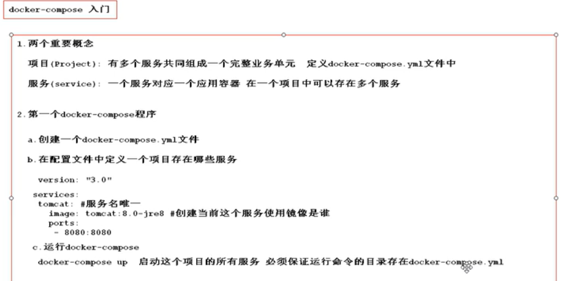

# 注意

- 输入虚拟机的ip

教程

- 编程不良人b站的docker视频
- [github上的教程](https://github.com/yeasy/docker_practice/blob/master/install/centos.md)

# 什么是docker

- 应用容器技术：将环境打包在容器中，在别的机器上就无需考虑环境的问题了。（如：mysql容器，redis容器）
  - 会将应用程序和环境一起打包
- 容器隔离 进程隔离

# docker与虚拟机


## 虚拟机缺点

- 虚拟机运行程序必须使用自带操作系统，会使一个小程序变得臃肿
- 虚拟内存 》虚拟物理内存 》 物理内存

## docker的优点

- 不携带操作系统
- 虚拟内存 》 物理内存

# CentOS7下安装docker

```shell
//使用脚本命令安装
$ curl -fsSL get.docker.com -o get-docker.sh
$ sudo sh get-docker.sh --mirror Aliyun

//查询状态,开启，重启docker（ctl control）
$ systemctl status | start | restart docker

//查询docker信息
$ docker info

//配置docker自启动
$ systemctl enable docker

//建立docker用户组，并将当前用户加入（super user do）
$ sudo groupadd docker
$ sudo usermod -aG docker $USER

//重启


```

# 核心概念&架构图


# 下载加速


# 入门案例

docker run hello-world


# 镜像操作


# 容器基本操作


- 数据卷存在并为空时，将容器中的内容复制到数据卷。不为空时，将数据卷复制到

# 数据卷详解


# 镜像分层原理


# 通信机制&网桥的使用.png


# 核心架构图


# 安装mysql


# 安装redis


# dockerfile


```java
创建dockerfile目录（上下文），文件

进入文件编写

//基于centos7
FROM centos7
//执行指令    
run yum install -y vim    
//将端口暴露，外界才能访问
EXPOSE 8080
//定义变量便于复用
ENV WORK_DIR B    
//进入容器后的落脚点，没有将自动创建。相对路径基于之前的绝对路径
WORKDIR /A
WORKDIR $WORK_DIR    
//将文件(war包)传入到容器中
COPY AA.txt /A/B
//可以写URL/压缩包，直接下载/解压到目录中。   
ADD www.tomcat.com /A/B
ADD tomcat.tar.zg /A/B    
//数据卷
VOLUME /data/websapp    
//run后直接执行指令,CMD也一样。但更多的是EP写指令，CMD写参数。run后直接跟参数
ENTRYPOINT ["ls"]    
CMD ["/"]    

//退回到目录执行。.当前目录。-t 仓库名:版本号。仓库名小写

docker build -t myCentOS7:0.1 .
```

# 构建springboot应用

```java
开发好项目
用maven的package打成jar包
//全选路径直接输入cmd    
用cmd运行java -jar xxx.jar

```


# idea中docker插件和远程连接docker

```java
- 插件中搜索docker
- 重启
- 创建file名称为Dockerfile    

- Tools -> Deployment -> browser remote host
- ... -> 输入ip,选择sftp -> 完善远程端信息    

创建Dockerfile,书写，上传    
```

# docker-compose的使用



