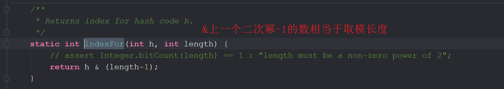

# HashMap 1.7 源码分析

> 运算符

- & 都为1才为1
- ^ 相等为0 不相等为1
- | 有1为1

> **hashmap由数组和链表组成的，那么它是如何把数据放入数组中的呢？下标怎么来的？**

计算出key的hash值再通过indexFor()方法来获取一个i获取table[i]上的entry。


entry : 由hash key value next组成。next是链表指针

put时是从头部插入（1.7）不是应该遍历完链表插入尾部吗？

> 初始化


初始化都会调用这个HashMap(int ,float)

默认：容量为16，加载因子为0.75

阈值会赋上容量的值

> 第一次put

put方法


hash计算




//这叫抖动函数


创建数组


添加

```java
addEntry(hash, key, value, i);

//判断是扩容还是直接添加
void addEntry(int hash, K key, V value, int bucketIndex) {
    //元素是否大于阈值			//当前位置是否为空
    if ((size >= threshold) && (null != table[bucketIndex])) {
        //2.重构一个两倍长度（默认32）----------
        resize(2 * table.length);
        hash = (null != key) ? hash(key) : 0;
        bucketIndex = indexFor(hash, table.length);
    }
	//1.......添加
    createEntry(hash, key, value, bucketIndex);
}

//1........添加
void createEntry(int hash, K key, V value, int bucketIndex) {
    Entry<K,V> e = table[bucketIndex];
    //插入到头部
    table[bucketIndex] = new Entry<>(hash, key, value, e);
    size++;
}

//2.重构--------
void resize(int newCapacity) {
    Entry[] oldTable = table;
    int oldCapacity = oldTable.length;
    if (oldCapacity == MAXIMUM_CAPACITY) {
        threshold = Integer.MAX_VALUE;
        return;
    }

    Entry[] newTable = new Entry[newCapacity];
    //、、、、3元素转换、、、 ----4.初始化hash种子----
    transfer(newTable, initHashSeedAsNeeded(newCapacity));
    table = newTable;
    threshold = (int)Math.min(newCapacity * loadFactor, MAXIMUM_CAPACITY + 1);
}

//、、、3元素转换、、、
void transfer(Entry[] newTable, boolean rehash) {
    int newCapacity = newTable.length;
    //数组
    for (Entry<K,V> e : table) {
        //链表
        while(null != e) {
            //多线程在这个代码上阻塞会导致第二个线程不停的循环链表从而耗尽cpu
            //可以明确数组容量并将加载因子设为1来避免扩容
            Entry<K,V> next = e.next;
            //重新计算hash值（一般不会执行）
            if (rehash) {
                e.hash = null == e.key ? 0 : hash(e.key);
            }
            //(之前的下标位置 或 之前的下标位置+之前的数组长度)
            int i = indexFor(e.hash, newCapacity);
            //将old链表的头放入new链表的尾
            //就是说链表会翻转
            e.next = newTable[i];
            newTable[i] = e;
            e = next;
        }
    }
}

//-----4.初始化hash种子（用来让散列更加散列）-----
final boolean initHashSeedAsNeeded(int capacity) {
    //false						默认为0
    boolean currentAltHashing = hashSeed != 0;
    //false						true	false
    boolean useAltHashing = sun.misc.VM.isBooted() &&
        //-----5更改本地的hash阈值(默认为int的最大值,可以设置)------
        (capacity >= Holder.ALTERNATIVE_HASHING_THRESHOLD);
    //flase				flase			false	
    boolean switching = currentAltHashing ^ useAltHashing;
    if (switching) {
        hashSeed = useAltHashing
            ? sun.misc.Hashing.randomHashSeed(this)
            : 0;
    }
    //false
    return switching;
}


```

**fastfall机制**

```java
HashMap<String,String> map = new HashMap<>();
map.put("1","1");
map.put("2","2");

for(String key:map.keySet())
{
    if(key.equals("2"))
        map.remove(key);
}


```

会抛java.util.ConcurrentModificationException

让我们来看看反编译的程序

```java
HashMap<String, String> map = new HashMap();
//put会使modCount++
map.put("1", "1");	
map.put("2", "2");	
//------1------
//expectedModCount被赋上modCount的值：2
Iterator i$ = map.keySet().iterator();

while(i$.hasNext()) {
    //------2-------
    //会检测expectedModCount的值和modCount的值是否相等并抛异常
    //为的是怕多线程中一个put一个remove
    String key = (String)i$.next();
    if (key.equals("2")) {
        //remove会使modcount++
        map.remove(key);		
    }
}

//--------1-----
private abstract class HashIterator<E> implements Iterator<E> {
    Entry<K,V> next;        // next entry to return
    int expectedModCount;   // For fast-fail
    int index;              // current slot
    Entry<K,V> current;     // current entry

    HashIterator() {
        //构造方法中被赋值
        expectedModCount = modCount;
        if (size > 0) { // advance to first entry
            Entry[] t = table;
            while (index < t.length && (next = t[index++]) == null)
                ;
        }
    }
    
    //--------2-------
    final Entry<K,V> nextEntry() {
        //不相同就抛出异常
        if (modCount != expectedModCount)
            throw new ConcurrentModificationException();
        Entry<K,V> e = next;
        if (e == null)
            throw new NoSuchElementException();

        if ((next = e.next) == null) {
            Entry[] t = table;
            while (index < t.length && (next = t[index++]) == null)
                ;
        }
        current = e;
        return e;
    }
}


```

解决办法

```java
HashMap<String, String> map = new HashMap();
map.put("1", "1");
map.put("2", "2");
Iterator i$ = map.keySet().iterator();

while(i$.hasNext()) {
    String key = (String)i$.next();
    if (key.equals("2")) {
        //------1-------
        //调用iterator中的方法
        //remove完后会 expectedModCount = modCount
        i$.remove();
    }
}

//------1---------
public void remove() {
    if (current == null)
        throw new IllegalStateException();
    if (modCount != expectedModCount)
        throw new ConcurrentModificationException();
    Object k = current.key;
    current = null;
    HashMap.this.removeEntryForKey(k);
    //remove完后赋值
    expectedModCount = modCount;
}

```

结论：多线程扩容会有问题

扩容后元素怎么分配的没搞懂。

# ConcurrentHashMap 1.7 

解决并发问题：

- hashtable: 整个map使用一把锁
- concurrentHashMap: 使用的是元素共用一把锁，而不是一个hashMap一把锁。

初始化： 容量  加载因子 并发级别

level 分组 默认16 16把锁

segment 锁  小hashMap（覆盖HashMap中的元素） 里面有锁

put 先计算key放入数组segment中的哪一个 在放入小hashmap中

局部扩容


ConcurrentHashMap由segment数组组成

segment数组（8 4）由容量（16 16）和并发级别（8 4）确定 

```java
public class ConcurrentHashMap<K, V> extends AbstractMap<K, V>
{
    public ConcurrentHashMap(int initialCapacity,float loadFactor, int concurrencyLevel) {
        if (!(loadFactor > 0) || initialCapacity < 0 || concurrencyLevel <= 0)
            throw new IllegalArgumentException();
        if (concurrencyLevel > MAX_SEGMENTS)
            concurrencyLevel = MAX_SEGMENTS;
        // Find power-of-two sizes best matching arguments
        int sshift = 0;
        int ssize = 1;
        //ssize为大于等于并发等级的2次幂数
        while (ssize < concurrencyLevel) {
            ++sshift;
            ssize <<= 1;
        }
        this.segmentShift = 32 - sshift;
        this.segmentMask = ssize - 1;
        if (initialCapacity > MAXIMUM_CAPACITY)
            initialCapacity = MAXIMUM_CAPACITY;
        //数组/并发级别
        int c = initialCapacity / ssize;
        if (c * ssize < initialCapacity)
            ++c;
        //数组容量最小为2
        int cap = MIN_SEGMENT_TABLE_CAPACITY;
        //向上取2次幂整，怕漏掉
        //要求出segment数组的hashEntry里的位置
        while (cap < c)
            cap <<= 1;
        // create segments and segments[0]
        //创建segements[0]：hashEntry的大小为cap
        Segment<K,V> s0 =
            new Segment<K,V>(loadFactor, (int)(cap * loadFactor),
                             (HashEntry<K,V>[])new HashEntry[cap]);
        //构造segment数组
        Segment<K,V>[] ss = (Segment<K,V>[])new Segment[ssize];
        UNSAFE.putOrderedObject(ss, SBASE, s0); // ordered write of segments[0]
        this.segments = ss;
    }
    
    public V put(K key, V value) {
        Segment<K,V> s;
        if (value == null)
            throw new NullPointerException();
        int hash = hash(key);
        int j = (hash >>> segmentShift) & segmentMask;
        //并发获取确保线程安全
        if ((s = (Segment<K,V>)UNSAFE.getObject          // nonvolatile; recheck
             (segments, (j << SSHIFT) + SBASE)) == null) //  in ensureSegment
            //获取不到就新建
            s = ensureSegment(j);
        return s.put(key, hash, value, false);
    }
    
    Segment(float lf, int threshold, HashEntry<K,V>[] tab) {
        this.loadFactor = lf;
        this.threshold = threshold;
        this.table = tab;
    }
    
    static final class HashEntry<K,V> {
        final int hash;
        final K key;
        volatile V value;
        volatile HashEntry<K,V> next;
        
        //....
        }
	}

    private Segment<K,V> ensureSegment(int k) {
        final Segment<K,V>[] ss = this.segments;
        long u = (k << SSHIFT) + SBASE; // raw offset
        Segment<K,V> seg;
        if ((seg = (Segment<K,V>)UNSAFE.getObjectVolatile(ss, u)) == null) {
            Segment<K,V> proto = ss[0]; // use segment 0 as prototype
            //获取segment[0]的长度
            int cap = proto.table.length;
            float lf = proto.loadFactor;
            int threshold = (int)(cap * lf);
            //创建新的segment
            HashEntry<K,V>[] tab = (HashEntry<K,V>[])new HashEntry[cap];
            if ((seg = (Segment<K,V>)UNSAFE.getObjectVolatile(ss, u))
                == null) { // recheck
                Segment<K,V> s = new Segment<K,V>(lf, threshold, tab);
                while ((seg = (Segment<K,V>)UNSAFE.getObjectVolatile(ss, u))
                       == null) {
                    if (UNSAFE.compareAndSwapObject(ss, u, null, seg = s))
                        break;
                }
            }
        }
        return seg;
    }

final V put(K key, int hash, V value, boolean onlyIfAbsent) {
    //获取锁
    HashEntry<K,V> node = tryLock() ? null :
    //循环获取锁
    scanAndLockForPut(key, hash, value);
    V oldValue;
    try {
        HashEntry<K,V>[] tab = table;
        int index = (tab.length - 1) & hash;
        HashEntry<K,V> first = entryAt(tab, index);
        for (HashEntry<K,V> e = first;;) {
            if (e != null) {
                K k;
                if ((k = e.key) == key ||
                    (e.hash == hash && key.equals(k))) {
                    oldValue = e.value;
                    if (!onlyIfAbsent) {
                        e.value = value;
                        ++modCount;
                    }
                    break;
                }
                e = e.next;
            }
            else {
                if (node != null)
                    node.setNext(first);
                else
                    node = new HashEntry<K,V>(hash, key, value, first);
                int c = count + 1;
                if (c > threshold && tab.length < MAXIMUM_CAPACITY)
                    rehash(node);
                else
                    setEntryAt(tab, index, node);
                ++modCount;
                count = c;
                oldValue = null;
                break;
            }
        }
    } finally {
        unlock();
    }
    return oldValue;
}
}
```


# HashMap1.8

```java
//treeNode 属性
static final class TreeNode<K,V> extends LinkedHashMap.Entry<K,V> {
    TreeNode<K,V> parent;  // red-black tree links
    TreeNode<K,V> left;
    TreeNode<K,V> right;
    TreeNode<K,V> prev;    // needed to unlink next upon deletion
    boolean red;
}

//添加
public V put(K key, V value) {
    //计算hash值-----------1-------
    return putVal(hash(key), key, value, false, true);
}

    /**
     * Implements Map.put and related methods
     *
     * @param hash hash for key
     * @param key the key
     * @param value the value to put
     * @param onlyIfAbsent if true, don't change existing value
     * @param evict if false, the table is in creation mode.
     * @return previous value, or null if none
     */
final V putVal(int hash, K key, V value, boolean onlyIfAbsent,
               boolean evict) {
    Node<K,V>[] tab; Node<K,V> p; int n, i;
    //数组为空，resize()
    //resize() : 扩容或初始化
    //--------3------------
    if ((tab = table) == null || (n = tab.length) == 0)
        n = (tab = resize()).length;
    //数组位置上为空，插入
    if ((p = tab[i = (n - 1) & hash]) == null)
        tab[i] = newNode(hash, key, value, null);
    else {
        Node<K,V> e; K k;
        //key相等时
        if (p.hash == hash &&
            ((k = p.key) == key || (key != null && key.equals(k))))
            e = p;
        //红黑树
        else if (p instanceof TreeNode)
            e = ((TreeNode<K,V>)p).putTreeVal(this, tab, hash, key, value);
        //链表
        else {
            for (int binCount = 0; ; ++binCount) {
                 //插到尾结点，因为要遍历链表确定是否要变为红黑树
                 //扩容时也一样，就不会出现1.7的扩容死循环
                //此时已经有8个了
                if ((e = p.next) == null) {  
                    //此时已经有9个了
                    p.next = newNode(hash, key, value, null);
                    if (binCount >= TREEIFY_THRESHOLD - 1) // -1 for 1st
                        //树化---------2-----------
                        treeifyBin(tab, hash);
                    break;
                }
                //key相等，break
                if (e.hash == hash &&
                    ((k = e.key) == key || (key != null && key.equals(k))))
                    break;
                p = e;
            }
        }
        if (e != null) { // existing mapping for key
            V oldValue = e.value;
            if (!onlyIfAbsent || oldValue == null)
                e.value = value;
            afterNodeAccess(e);
            return oldValue;
        }
    }
    ++modCount;
    //直接扩容，1.7的时候还会判断是否为空
    if (++size > threshold)
        resize();
    afterNodeInsertion(evict);
    return null;
}

//-------------1--------------
static final int hash(Object key) {
    int h;
    //高位参加异或，没有1.7那么多的异或是因为有了黑红树，插入和删除的效率有了保证
    return (key == null) ? 0 : (h = key.hashCode()) ^ (h >>> 16);
}

//========2=============
final void treeifyBin(Node<K,V>[] tab, int hash) {
    int n, index; Node<K,V> e;
    //大于等64
    if (tab == null || (n = tab.length) < MIN_TREEIFY_CAPACITY)
        resize();
    else if ((e = tab[index = (n - 1) & hash]) != null) {
        TreeNode<K,V> hd = null, tl = null;
        do {
            //把链表结点转换成树结点，结点前后相连
            TreeNode<K,V> p = replacementTreeNode(e, null);
            if (tl == null)
                hd = p;
            else {
                p.prev = tl;
                tl.next = p;
            }
            tl = p;
        } while ((e = e.next) != null);
        if ((tab[index] = hd) != null)
            //真正开始树化
            hd.treeify(tab);
    }
}

//------------3----------
final Node<K,V>[] resize() {
    //初始化
    Node<K,V>[] oldTab = table;
    int oldCap = (oldTab == null) ? 0 : oldTab.length;
    int oldThr = threshold;
    int newCap, newThr = 0;
    if (oldCap > 0) {
        if (oldCap >= MAXIMUM_CAPACITY) {
            threshold = Integer.MAX_VALUE;
            return oldTab;
        }
        else if ((newCap = oldCap << 1) < MAXIMUM_CAPACITY &&
                 oldCap >= DEFAULT_INITIAL_CAPACITY)
            newThr = oldThr << 1; // double threshold
    }
    else if (oldThr > 0) // initial capacity was placed in threshold
        newCap = oldThr;
    else {               // zero initial threshold signifies using defaults
        newCap = DEFAULT_INITIAL_CAPACITY;
        newThr = (int)(DEFAULT_LOAD_FACTOR * DEFAULT_INITIAL_CAPACITY);
    }
    if (newThr == 0) {
        float ft = (float)newCap * loadFactor;
        newThr = (newCap < MAXIMUM_CAPACITY && ft < (float)MAXIMUM_CAPACITY ?
                  (int)ft : Integer.MAX_VALUE);
    }
    threshold = newThr;
    @SuppressWarnings({"rawtypes","unchecked"})
    Node<K,V>[] newTab = (Node<K,V>[])new Node[newCap];
    table = newTab;
    //扩容
    if (oldTab != null) {
        //遍历map
        for (int j = 0; j < oldCap; ++j) {
            Node<K,V> e;
            if ((e = oldTab[j]) != null) {
                oldTab[j] = null;
                //如果只有一个元素就直接重算下hash放入新数组
                if (e.next == null)
                    newTab[e.hash & (newCap - 1)] = e;
                //如果是棵树
                //-----4------
                else if (e instanceof TreeNode)
                    ((TreeNode<K,V>)e).split(this, newTab, j, oldCap);
                //大于一个元素的链表
                else { // preserve order
                    Node<K,V> loHead = null, loTail = null;
                    Node<K,V> hiHead = null, hiTail = null;
                    Node<K,V> next;
                    do {
                        next = e.next;
                        //主要逻辑
                        //将元素的hash &上之前的长度，分为1和0两个链表，再一起转移
                        if ((e.hash & oldCap) == 0) {
                            if (loTail == null)
                                loHead = e;
                            else
                                loTail.next = e;
                            loTail = e;
                        }
                        else {
                            if (hiTail == null)
                                hiHead = e;
                            else
                                hiTail.next = e;
                            hiTail = e;
                        }
                    } while ((e = next) != null);
                    if (loTail != null) {
                        loTail.next = null;
                        newTab[j] = loHead;
                    }
                    if (hiTail != null) {
                        hiTail.next = null;
                        newTab[j + oldCap] = hiHead;
                    }
                }
            }
        }
    }
    return newTab;
}

final void split(HashMap<K,V> map, Node<K,V>[] tab, int index, int bit) {
    TreeNode<K,V> b = this;
    // Relink into lo and hi lists, preserving order
    TreeNode<K,V> loHead = null, loTail = null;
    TreeNode<K,V> hiHead = null, hiTail = null;
    int lc = 0, hc = 0;
    //遍历之前成为树时的双向链表,有计数器
    for (TreeNode<K,V> e = b, next; e != null; e = next) {
        next = (TreeNode<K,V>)e.next;
        e.next = null;
        if ((e.hash & bit) == 0) {
            if ((e.prev = loTail) == null)
                loHead = e;
            else
                loTail.next = e;
            loTail = e;
            ++lc;
        }
        else {
            if ((e.prev = hiTail) == null)
                hiHead = e;
            else
                hiTail.next = e;
            hiTail = e;
            ++hc;
        }
    }
	
    
    if (loHead != null) {
        //计数器小于等于6就链化，转化成单向链表
        if (lc <= UNTREEIFY_THRESHOLD)
            tab[index] = loHead.untreeify(map);
        else {
            tab[index] = loHead;
            //如果另一链表是空的就直接转移
            if (hiHead != null) // (else is already treeified)
                loHead.treeify(tab);
        }
    }
    if (hiHead != null) {
        if (hc <= UNTREEIFY_THRESHOLD)
            tab[index + bit] = hiHead.untreeify(map);
        else {
            tab[index + bit] = hiHead;
            if (loHead != null)
                hiHead.treeify(tab);
        }
    }
}

```

