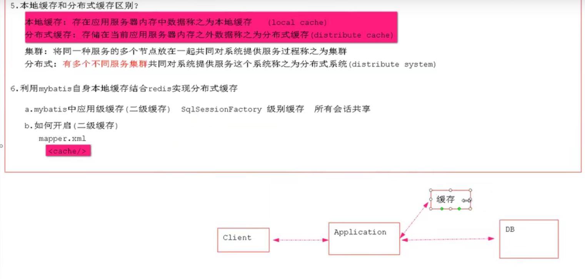
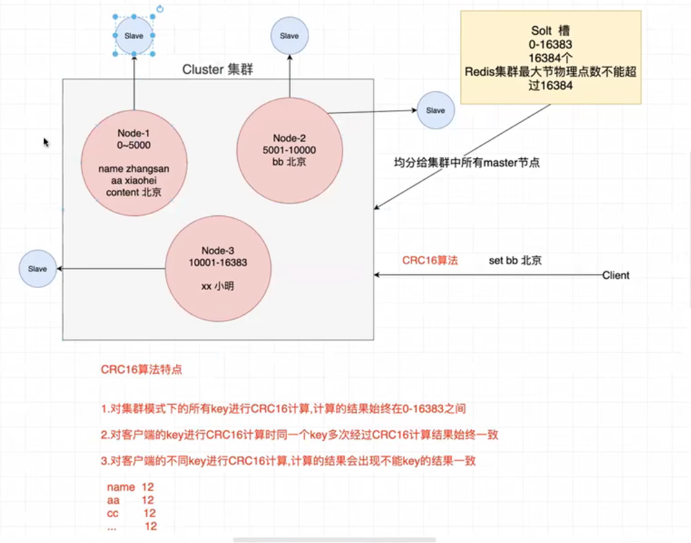

# 黑马程序员redis

# 下载

- 去github上下载.zip文件，解压即可

# 使用

- 双击 redis-server.exe
  - port: 端口
  - pid : 名称
  - 下面有时间轴的是日志
- 双击redis-cli.exe

# 基本操作

- 添加（key相同会覆盖）

```java
set key value
```

- 查询key所对的value，不存在返回空（nil）

```java
get key
```

- 清屏

```java
clear
```

- 帮助

```java
help 命令名
help @群组名    
```

- 退出

```java
quit
[esc]    
```


# 数据类型(key一直都是String)

## String

### 基本操作

```java
//添加
set key value
    
//获取
get key

//删除（操作成功为：(integer)1, 失败为： (integer)0）    
del key    
    
//添加多个
mset key1 value1 key2 value2 ...    
    
//获取多个    
mget key1 key2 ...    
```

# springboot整合redis

项目：redis_demo1


```java
//1.引入依赖
        <dependency>
            <groupId>org.springframework.boot</groupId>
            <artifactId>spring-boot-starter-data-redis</artifactId>
            <scope>test</scope>
        </dependency>
            
            
//2.编写配置文件
server.port=8080
//远程控制
spring.redis.host=192.168.211.128
spring.redis.port=6379
spring.redis.database=0       
            
//3.测试类

//3.1使用StringReidsTemplate往reids中存入key value都是字符串            
//启动spring应用
@SpringBootTest(classes = DemoApplication.class)
@RunWith(SpringRunner.class)
class DemoApplicationTests {

    @Autowired
    private StringRedisTemplate srt;

	@Test
	void testString() {
	    //opsForValue()就是redis中的String
	    srt.opsForValue().set("name","小陈");
        String name = srt.opsForValue().get("name");
        System.out.println("name : "+name);
    }


    //操作key
    @Test
    void testKey(){
        Boolean name = srt.hasKey("name");
        System.out.println(name);
        DataType name1 = srt.type("name");
        System.out.println(name1);
        Set<String> keys = srt.keys("*");
        keys.forEach(key -> System.out.println("key = "+ key));

    }
    
    //操作list
    @Test
    void testList(){
	    srt.opsForList().leftPush("names","小陈");
	    srt.opsForList().leftPushAll("names","小李","小张");
        List<String> list = new ArrayList<>(3);
        list.add("zhangsan");
        list.add("lisi");
	    srt.opsForList().leftPushAll("names", list);

        List<String> names = srt.opsForList().range("names", 0, -1);
        names.forEach(name -> System.out.println("value = " + name));

        //截取1到2
        srt.opsForList().trim("names",1,2);

    }

}

//3.2.1使用RedisTemplate往redis中存入key value为object，需要序列化

//3.2.2使用rt中的setKeyserializer(new StringRedisSerializer());修改序列化方案使key存储的使string，就可以在redis中对key进行操作。[hashkey]

//3.2.3使用boundValueops()进行绑定操作
    @Test
    void testBound(){
	    //对一个key进行绑定操作
        BoundValueOperations<String,String> bvo = srt.boundValueOps("name");
        bvo.set("zhangsan");
        bvo.append("is a bad man");
    }
            
```


# 分布式缓存



应用服务器重启则丢失，需要再去查询db

别的应用服务器无法使用

## 一

```java
底层原理

- CerpetualCache实现Cache,数据结构是map
- 第一次查询put，第二次查询直接get    
- 自定义RedisCache
- 	实现Cache
//修改缓存标签    
- 	<cache type="xxx.RedisCache">    
//关联关系的表共享缓存,填入对方的namespace
- 	<cache-ref namespace="" />    
```

## 二

```java
1.优化
    放入的key的名称太长，可以用MD5来生成32位的16进制的字符串
	算法：MD5	
    特点：
    	1.字符串经过MD5处理后会生成32位的16进制的字符串
    	2.不同内容加密结果不同，相同则相同
2.面试
	1).缓存穿透
    	定义：客户端查询数据库中没有的数据导致缓存运用不上。
    		mybatis中的解决方案为：将没有查询到结果的也进行缓存为null
    
    2).缓存雪崩
    	定义: 某一时刻，缓存失效，恰好此时涌入大量请求，导致大量缓存模块无法使用，大量请求涌入数据库，导致数据库挂起或阻塞
            业务系统大，不同模块放入缓存会设置超时时间
            
		解决方案：1.永久缓存（不推荐）          
            	2.针对不同的业务数据设置不同的超时时间
            
```

# redis主从复制

## 1.主从复制

​	解决数据的冗余备份，从节点仅仅用来同步数据，不可自动故障转移（主节点故障，从节点顶上）。


# reids哨兵机制

## 1.哨兵机制

​	在主从复制的基础上可以实现自动故障转移，由哨兵来监听

​	无法解决：1.单节点并发压力。 2.单节点内存和物理上限

## 2.原理

​	监听master，故障后选取slaver为master继续服务


## 3.springboot中使用

​	连接的是哨兵

# 集群





