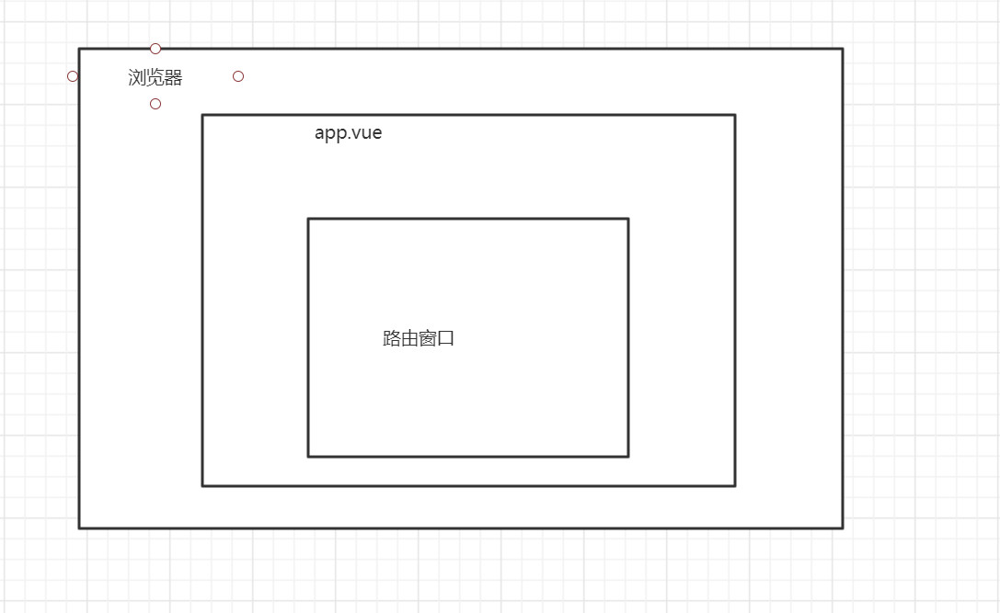

vue ui创建vue项目

勾选Router, Vuex。 不勾选Linter/Formatter。

勾选user history

不保存模板

- 网页

  - 任务
    - serve
      - 运行
      - 输出（点击链接）

- cmd： ctrl+c退出

- IDea导入文件

- Terminal： npm run serve (启动服务)

  

vue结构：

- app.vue为主体，路由窗口在切换

创建springboot项目

- 选择lombok，jpa，mysql，web
- 配置数据库，端口等信息

vue中搭建假数据模板

springBoot中创建实体类，持久层等，测试查询数据

vue安装插件axios

​	vue add axios

使用axios获取idea输出到网页的数据（返回的得是个数组才是正确的json格式）

​	在controller上使用@crossOrigin(url)来解决跨域

重开个vue，安装element-ui

将页面布置好，分页

# 总结

后端输出json格式的数据，前端接收并用其渲染页面

